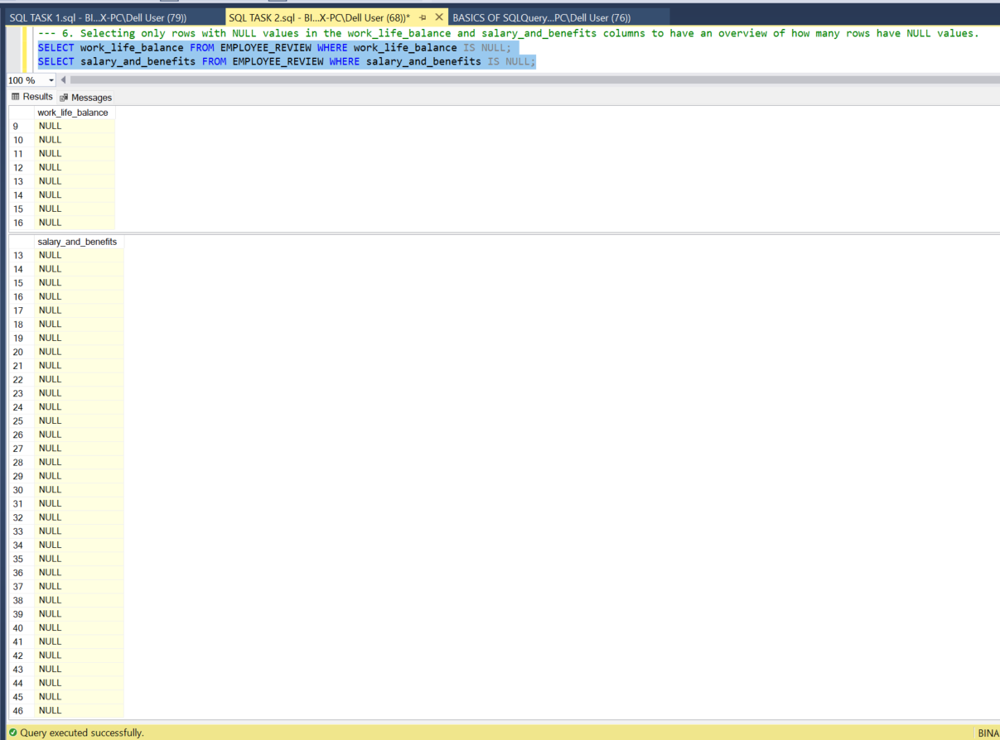
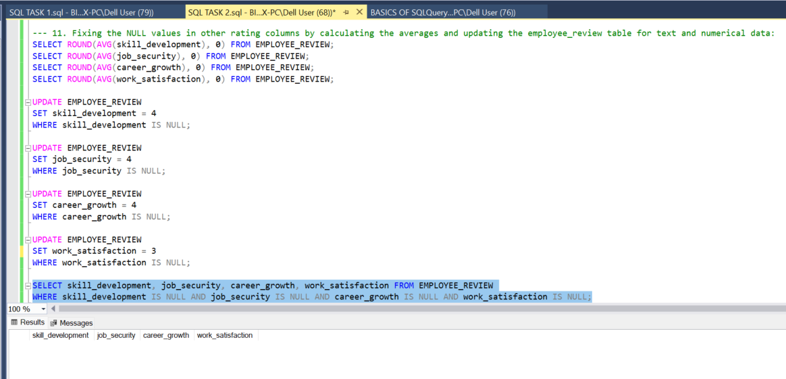
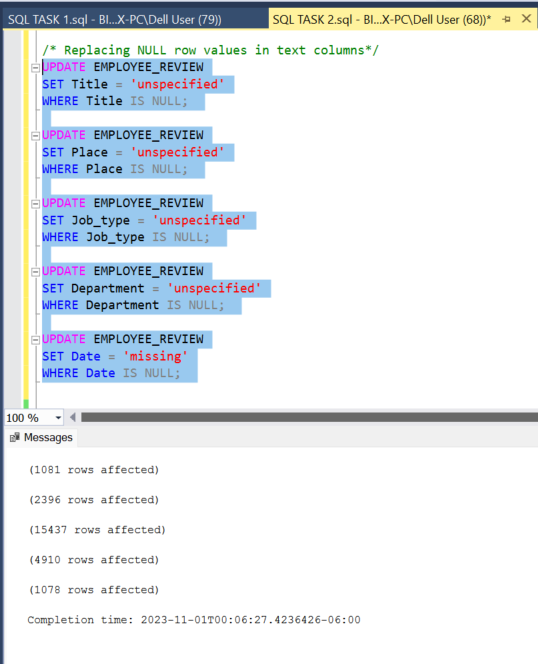
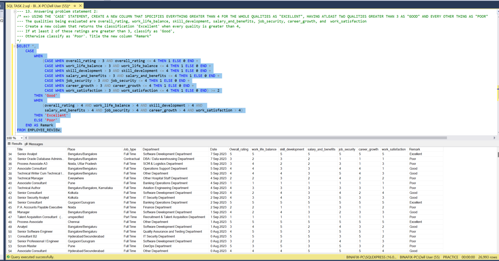
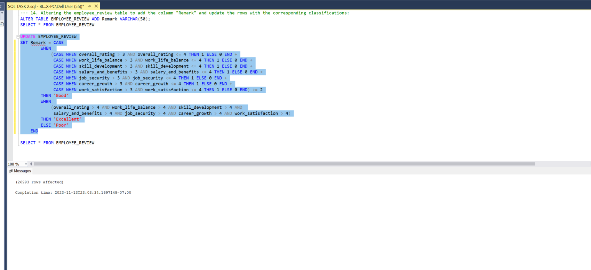
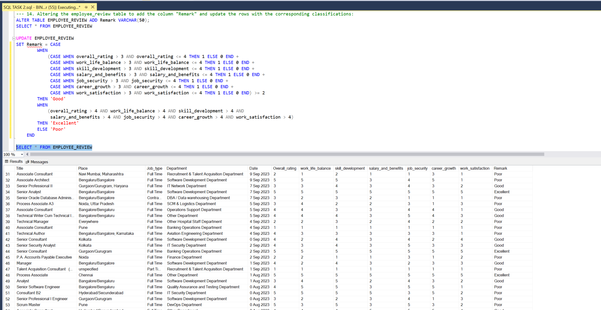

# Employees' Quality-of-Life and Job Satisfaction Analysis Using SQL

Image Link
---
https://blog.thewellnessuniverse.com/wp-content/uploads/2018/08/10-Ways-to-Increase-Your-Quality-of-Life-by-Moira-Hutchison-TheWellnessUniverse-WUVIP-QualityOfLife-1024x654.jpg

## Introduction:
This project analyses an employee dataset using SQL to answer pertinent questions about employees' overall quality of life and job satisfaction ratings and use the information and insights to make important company decisions.

_Disclaimer_: The dataset used and reports generated do not represent any company, institution, or country. It is a dummy dataset used to showcase SQL skills.

## Problem Statement:
==> FIND THE JOB TITLES IN THE "SOFTWARE_DEVELOPMENT_DEPARTMENT" THAT HAVE A "WORK LIFE BALANCE" RATING GREATER THAN 4 AND A "SALARY_AND_BENEFIT" RATING GREATER THAN 4.5.

==> USING THE 'CASE' STATEMENT, CREATE A NEW COLUMN THAT SPECIFIES EVERYTHING GREATER THAN 4 FOR THE WHOLE QUALITIES AS "EXCELLENT", HAVING ATLEAST TWO QUALITIES GREATER THAN 3 AS "GOOD" AND EVERY OTHER THING AS "POOR".

## Skills Demonstrated:
The following syntaxes and functions were demonstrated -
* CREATE and USE Database
* SELECT, SELECT DISTINCT, FROM, WHERE clauses
* DISTINCT COUNT
* ROUND(AVG()
* REPLACE, UPDATE, SET
* AND, OR, IS NULL, GREATER/LESS THAN, EQUAL TO
* CASE, WHEN, THEN
* ALTER TABLE, ADD, VARCHAR

## Data Analysis:

### 1. Creating the database 
I created a database and tited it "practice". Then I ensured the database created was selected. The dataset "employee_review" was already saved on my computer. This was imported into the "practice" database. I refreshed the database and ensured the table appeared.

### 2. Selecting the table
Selecting the employee_review table to have an overview of the columns and rows, and check if there are null values.

### 3. Checking for NULLS in specific columns
I selected disctint columns from the employee_review table to identify null values.

### 4. Selecting only rows with NULL values in the work_life_balance and salary_and_benefits columns to have an overview of how many rows have NULL values
- The total number of rows with NULL values in the work_life_balance column is 16
- The total number of rows with NULL values in the salary_and_benefits column is 46

### 5. Counting the number of rows in the dataset
- We have a total of 26,993 rows in the dataset.

### 6. Finding the average rating for both the work_life_balance and salary_and_benefits columns
- The average rating for the the work_life_balance column is 4
- The average rating for the the salary_and_benefits column is 3

### 7. Replacing NULL values 
I replaced the NULL values in both the work_life_balance and salary_and_benefits columns with the average rating using the "REPLACE" function but this did not take care of the Null values in the table.

### 9. Updating the table to reflect this change
To eliminate the Null values, I updated the employee_review table to reflect this change. As seen in the image below, 16 and 46 rows were affected, corresponding to the number of rows with null values in the work_life_balance and salary_and_benefits columns respectively.

### 10. Crosschecking the above syntax
I crosschecked to see that the above syntax worked as expected. Running the query with the IS NULL operator together with the SELECT ALL query showed no rows had NULL data.

### 11. Fixing the NULL values in other rating columns
Firstly, I calculated the averages before updating the employee_review table. 
- The average rating for the the skill_development column is 4
- The average rating for the the job_security column is 4
- The average rating for the the career_growth column is 4
- The average rating for the the work_satisfaction column is 3

Secondly, I updated the employee_review table and set each rating column where there are null values to the average rating to reflect this change.

Thirdly, I updated the employee_review table and rplaced null values text columns with unspecified and missing as shown below.
- The total number of rows affected in the title column is 1081
- The total number of rows affected in the place column is 2396
- The total number of rows affected in the Department column is 4910
- The total number of rows affected in the Date column is 1078

### 12. Answering problem statement 1:
==> FIND THE JOB TITLES IN THE "SOFTWARE DEVELOPMENT DEPARTMENT" THAT HAVE A "WORK LIFE BALANCE" RATING GREATER THAN 4 AND A "SALARY AND BENEFIT" RATING GREATER THAN 4.5
- I used several operators like (AND, =, >) to answer this question.
- The first syntax returned 8,936 rows
- The second syntax returned 1342 rows
- The third syntax returned 382 rows
- The fourth syntax returned the top 3 job titles as Senior Analyst, Software Consultant Python, And Associate Consultant

### 13. Answering problem statement 2:
==> USING THE 'CASE' STATEMENT, CREATE A NEW COLUMN THAT SPECIFIES EVERYTHING GREATER THAN 4 FOR THE WHOLE QUALITIES AS "EXCELLENT", HAVING ATLEAST TWO QUALITIES GREATER THAN 3 AS "GOOD" AND EVERY OTHER THING AS "POOR"
To understand the statement, I dissected it into small bits and executed it accordingly using the CASE statement.
- The qualities being evaluated are overall_rating, work_life_balance, skill_development, salary_and_benefits, job_security, career_growth, and  work_satisfaction
- Create a new column that returns the classification 'Excellent' when every quality is greater than 4,
- If at least 2 of these ratings are greater than 3, classify as 'Good',
- Otherwise classify as 'Poor'. Title the new column "Remark" 

### 14. Altering the table
I altered the employee_review table to add the column "Remark" to the table and update the rows with the corresponding classifications. As seen in the image below, all 26,993 columns were affected.

### 15. Selecting the table to check the final outcome
The remark column can be seen to have been successfully added to the table.

### Additional Question - Task 3
Showing the average yearly increment for employees with an average yearly increment greater than 5000 in each department (referencing a different data set).

## Conclusion:
- The analysis carried out was able to categorize the quality of life of employees based on several ratings. This can give the company an overview on how many employees are doing well in terms of their quality of life and how many employees are doing poorly.
- A deeper drilldown into the data can be done to fish out employees with poor quality of life in order to investigat factors contributing to this.
- Employees who are Senior Analysts, Software Consultants Python, and/or Associate Consultants topped the chart of job titles with an average work_life_balance and Salary_and_benefits rating of 4 and 4.5 respectively. We can carry out more investigation to check how this relates to their performance at work.
- We can narrow down the data to get the exact number of employees with excellent, good, and poor ratings and use this information to get an overview on whether or not the majority of employees have a good quality of life and are satisfied with their jobs.

Thank You. 😄
- 
